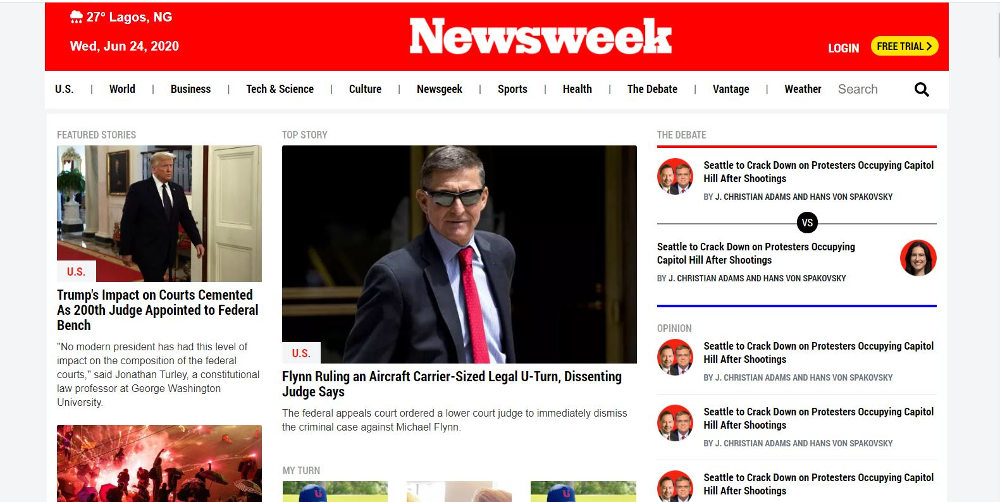

# USING BOOTSTRAP
PROJECT: Newsweeek.com Website Clone

**This is a clone of The Newsweek website**

## Built With

- HTML
- CSS3
- Bootstrap

[Live Demo Link](https://rawcdn.githack.com/Abidoyinsola1/newsweek-clone/02a809fab303cfa63e23c68ed8a9f6e5172ca878/index.html
)

## Getting Started

**1) Clone this Github repository.**

## Authors

👤 **Somoye Ayotunde Peter**

- Github: [@somoye123](https://github.com/somoye123)
- Twitter: [@twitterhandle](https://twitter.com/ayotunde_197)
- LinkedIn: [LinkedIn](https://www.linkedin.com/in/somoye-ayotunde-03a471161)

👤 **Adeyemi Abiola Doyinsola**

- Github: [@Abidoyinsola1](https://github.com/Abidoyinsola1)
- Twitter: [@Abidoyinsola](https://twitter.com/abidoyinsola)
- LinkedIn: [Doyinsola Abiola Adeyemi](https://www.linkedin.com/in/doyinsola-adeyemi)

## 🤝 Contributing

Contributions, issues and feature requests are welcome!

## Show your support

Give a ⭐️ if you like this project!